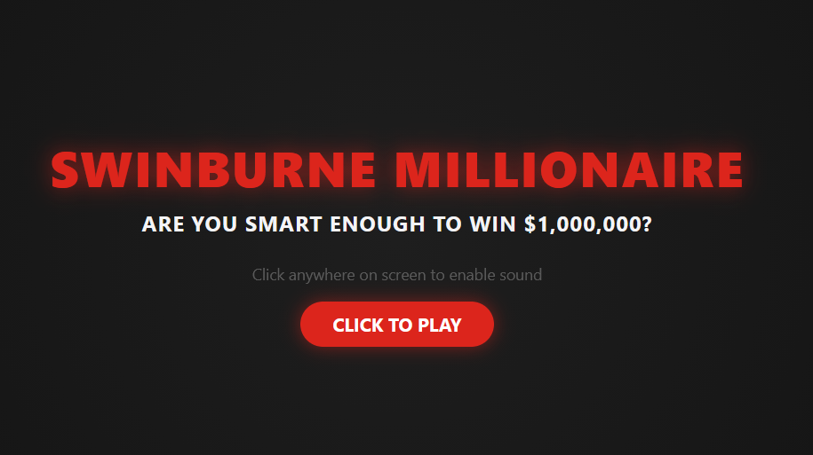
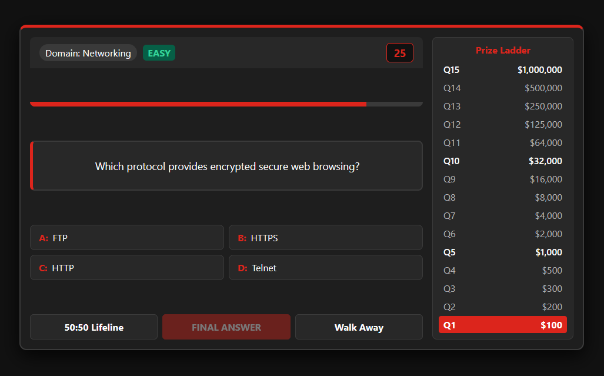
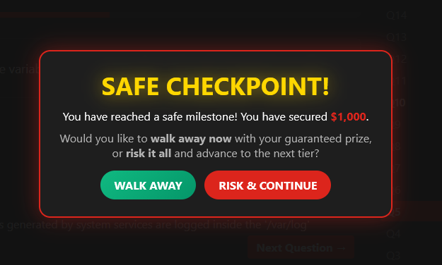
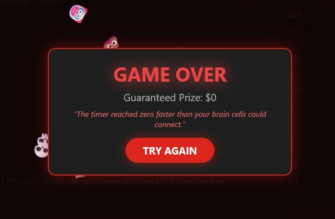

# 🏆 Swinburne Millionaire

> 🚀 **Play the Live App:** [https://swinburne-millionaire-app-abbma8f2gph2cge8.australiaeast-01.azurewebsites.net](https://swinburne-millionaire-app-abbma8f2gph2cge8.australiaeast-01.azurewebsites.net)

**Swinburne Millionaire** is an interactive, web-based cybersecurity and IT trivia game modeled after the classic *"Who Wants to Be a Millionaire?"* show format. Built with **Python (Flask)** and vanilla **JavaScript/CSS3**, it tests technical cybersecurity knowledge across 15 dynamic difficulty tiers.

---

## 📸 Application Screenshots

| Title Screen | Active Gameplay |
| :---: | :---: |
|  |  |

| Checkpoint | Game Over Screen |
| :---: | :---: |
|  |  |

---

## 🎮 How the Game Works

The objective of the game is simple: answer 15 consecutive cybersecurity questions correctly to win the top prize of **$1,000,000**.

### 1. Game Flow & Rule Mechanics
* **15 Question Tiers:** Questions increase in difficulty as you advance through three main tiers: **EASY** (Q1–Q5), **MEDIUM** (Q6–Q10), and **HARD** (Q11–Q15).
* **30-Second Countdown Timer:** Every question gives you 30 seconds to lock in an answer. If the timer reaches zero before you choose, the game ends immediately.
* **Lock-In Mechanism:** Clicking an option highlights your choice. You must click **FINAL ANSWER** to submit your option.
* **Instant Feedback & Explanations:** After submitting an answer, the game highlights whether you were correct (green) or wrong (red) and displays a detailed technical explanation for why that option was right or wrong.

---

## 🛡️ Lifelines & Safety Checkpoints

### 💡 50:50 Lifeline
* Accessible once per game session.
* Uses the server API to randomly eliminate **two incorrect choices**, leaving only the correct answer and one wrong distraction.

### 💰 Safe Checkpoints ($1,000 & $32,000)
When you successfully answer Question 5 ($1,000) or Question 10 ($32,000), you unlock a **Safe Milestone**:
* **Risk & Continue:** Proceed to harder questions while guaranteeing you won't leave empty-handed if you miss a future question.
* **Walk Away / Cash Out:** Choose to leave the game at any point before answering a question to lock in your current earnings.

---

## 🎭 Interactive Audio & Dynamic Events

* **Spotlights & Particle Animations:** Custom HTML5 canvas routines trigger background glitter effects upon winning and red spotlights when starting games.
* **Dynamic Audio Engine:** Contextual audio plays during ticks, lock-ins, safe choices, lifelines, game-over moments, and full victories.
* **Roast & Insult System:** If you run out of time or select a wrong option, the app dynamically assigns humorous cybersecurity-themed insults alongside custom falling emoji animations.

---

## ⚡ Tech Stack Summary

* **Backend Engine:** Python 3.11+, Flask Web Framework (Session-based state management)
* **Frontend Design:** HTML5, CSS3, Vanilla ES6 JavaScript
* **Media Handling:** HTML5 Audio API & HTML5 Canvas Rendering